# Eclipse, Spring Tool Suite

## Review the problem

First lets try what would happen if we rename a controller method in a Spring Boot applcation.

You can check out this project and import to your IDE.

Check the default JRE and the project JRE before we start.

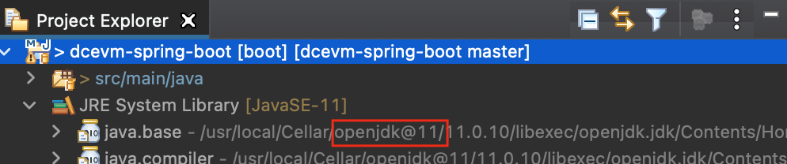

Make sure hot code replacement and auto build is enabled in your Eclipse

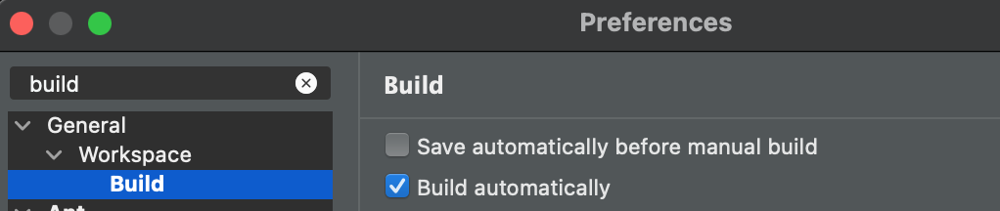

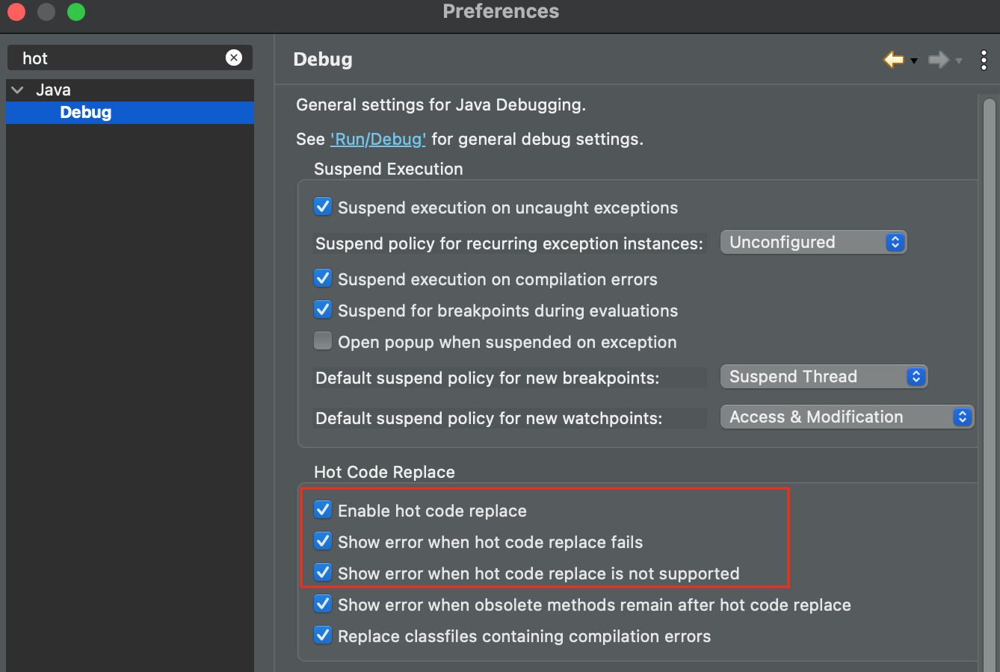

Start a debug session for the sample application, than open the `HelloController` class file.

When you rename the `index()` method to for example `newIndex()` and save the file you will see this error:

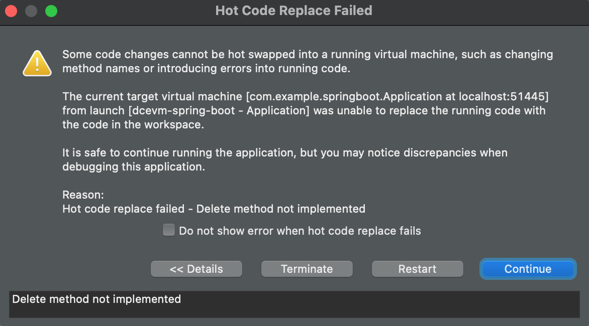

You would see the same error when you delete any method (rename is a delete and an add operation)
Not much better if you try to add a new method without change anything else in the existing code and save the file.

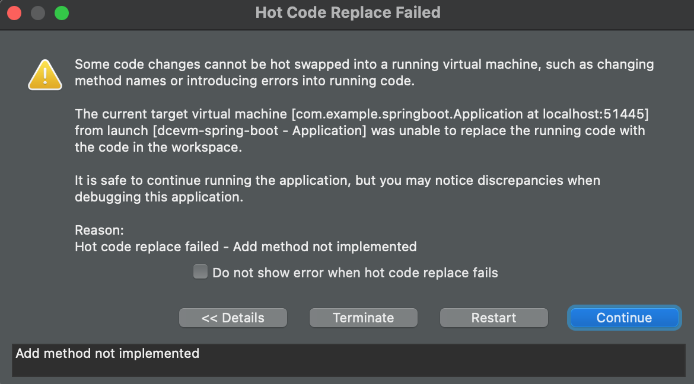

Not really developer friendly solution. You can always restart your application in this case, but that is
really inefficient way of working especially if you have 5-20 sec startup time.

Stop the debug session and....

## Try DCEVM

Add DCEVM to Eclipse

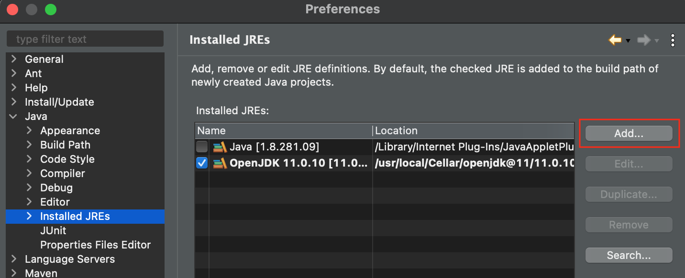

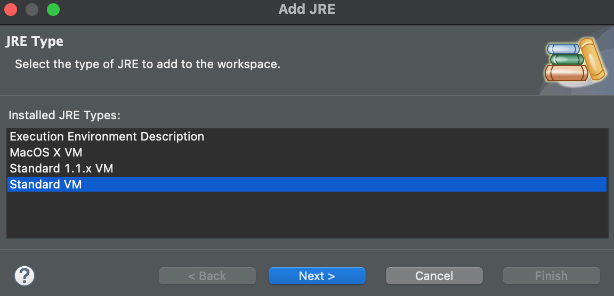

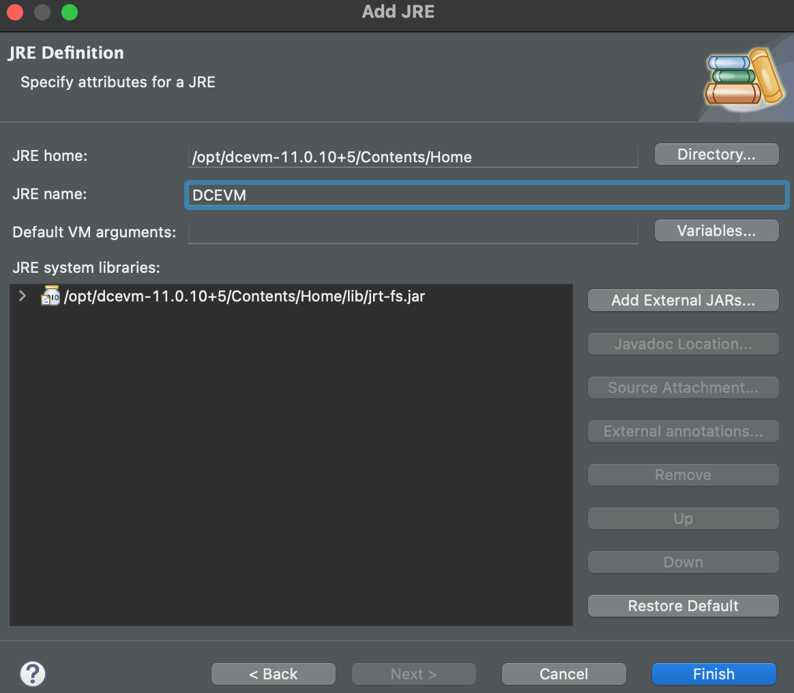

One more thing, we have to change the debug configuration to use DCEVM and pass the `-XX:HotswapAgent=` parameter to it.

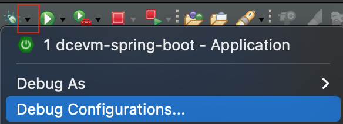

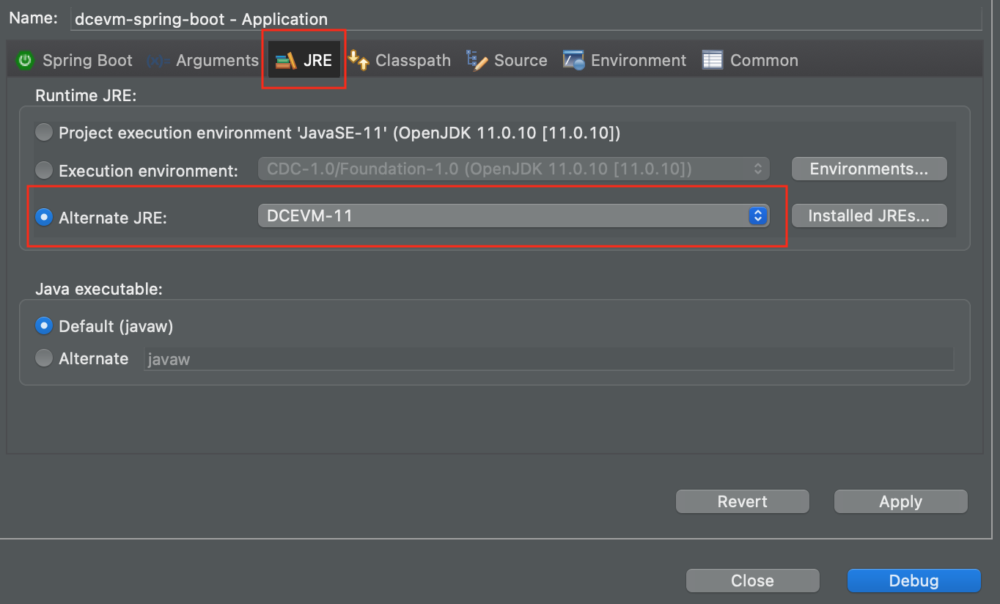

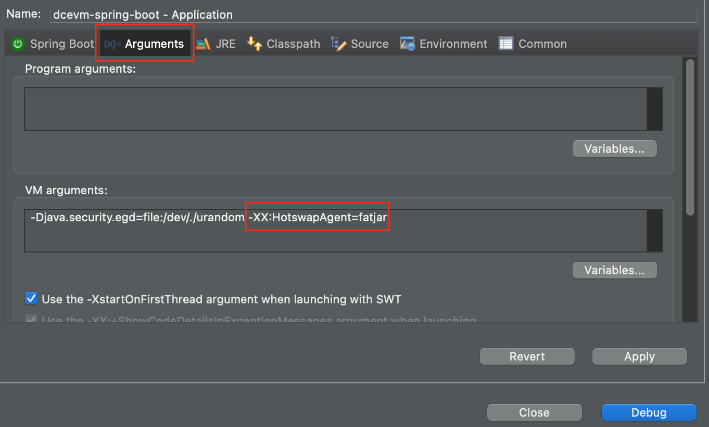

We can start our new debug session with DCEVM, and try to apply the changes again.

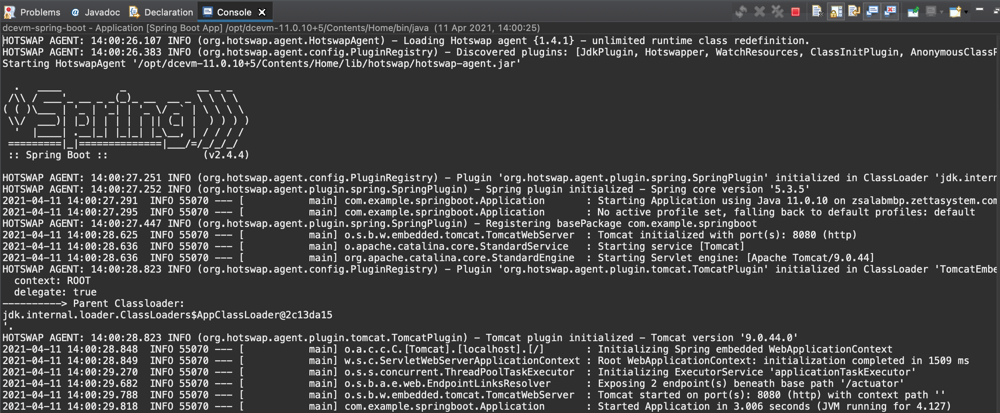

You can see in your terminal window something going on, the plugins needed for your code detected and initialized without any further configuration.

We can change the code now...

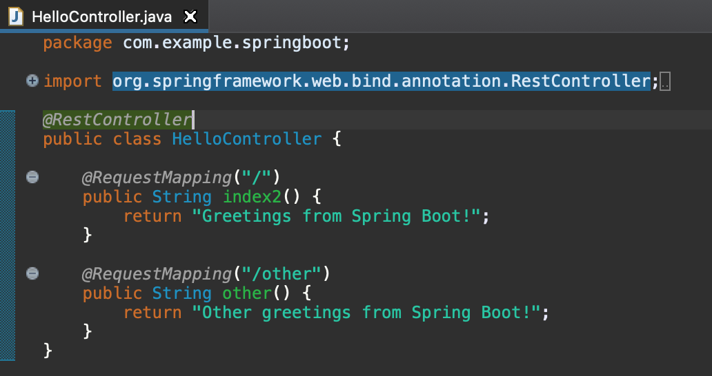

No complain about the unsupported hotswap operation after save the file. You will see in the terminal window the hotswap agent did some magic.

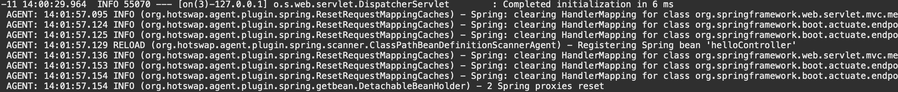

You can try to fetch the other method with `curl http://localhost:8080/other`, you will get the expected response.
We see the new method works as it was always be there, lets remove it and call `curl http://localhost:8080/other` as we expect the response is 404 Not Found error.

Good work!