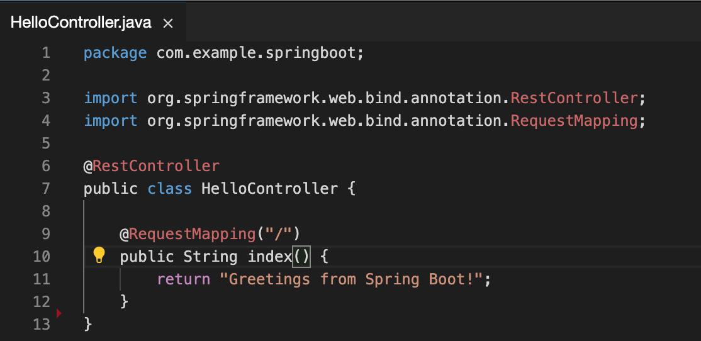

# Theia, Visual Studio Code

## Review the problem

First let's try what would happen if we rename a controller method in a Spring Boot applcation.

We should check our Java configuration, that can be on user or workspace level.

You can see on the image above the `java.home` and the `java.configuration.runtimes` points to the standard OpenJDK folder.

Make sure your `java.debug.settings.hotCodeReplace` configured `auto` and the `java.configuration.updateBuildConfiguration` configured to `automatic`

You can check out this project and import to your IDE. You will see the project JRE uses the OpenJDK JRE.

Start a debug session for the sample application, than open the `HelloController` class file.

When you rename the `index()` method to for example `newIndex()` and save the file you will see this error:

You would see the same error when you delete any method (rename is a delete and an add operation)
Not much better if you try to add a new method without change anything else in the existing code.

Not really developer friendly solution. You can always restart your application in this case, but that is
really inefficient way of working especially if you have 5-20 sec startup time.

Stop the debug session and....

## Try DCEVM

Install DCEVM to your computer if you have not done yet.
[https://github.com/TravaOpenJDK/trava-jdk-11-dcevm/releases](https://github.com/TravaOpenJDK/trava-jdk-11-dcevm/releases)

We just have to change the project runtime VM configuration and add the `-XX:HotswapAgent=` VM argument for the launch config.

You can see above, the `java.home` still points to the OpenJDK but the `java.configuration.runtimes` points to the DCEVM now.

We can check the change has applied (you may ask your IDE to reload the project regards to the configuration change)

One more step, we have to enable the Hotswap Agent as it is disable in DCEVM by default.

We can start our debug session with DCEVM and try to apply the changes again.

You can see in your terminal window something going on, the plugins needed for your code detected and initialized without any further configuration.

We can change the code now...

No complain about the unsupported hotswap operation after save the file. You will see in the terminal window the hotswap agent did some magic.

You can try to fetch the other method with `curl http://localhost:8080/other`, you will get the expected response.
We see the new method works as it was always be there, lets remove it and call `curl http://localhost:8080/other` as we expect the response is 404 Not Found error.

Good work!